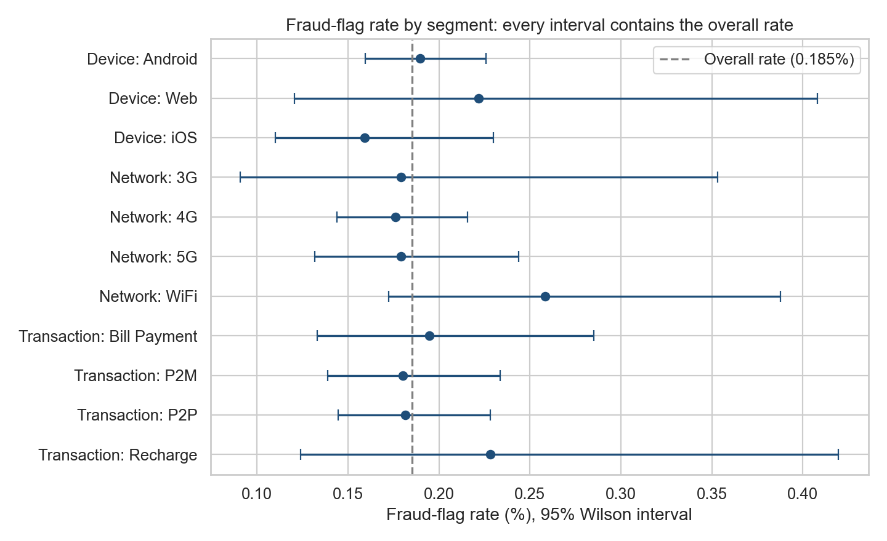

# UPI Transaction Intelligence & Fraud Analytics — 2024

## Project Overview
This project analyzes a 2024 UPI transaction dataset to understand digital-payment behavior, payment performance, regional and banking patterns, merchant activity, fraud-flagged transactions, and unusual transaction-volume patterns.

It combines **Python analytics, SQL (SQLite), statistical testing, an interactive dashboard, anomaly screening, and an AI-assistant guide for IBM Bob**. A central goal is to report only what the data can support: every "highest" ranking is checked against a significance test before it is called a finding.



## Dataset
- Records: **89,019** | Columns: **22** | Date range: **2024-01-01 to 2024-12-30**
- Dataset file: `upi_transactions_2024_clean.csv` (no missing values, no duplicate transaction IDs)
- Source: 2024 UPI transaction CSV supplied for the academic internship. No public dataset URL was supplied.
- Column definitions and metric rules: [`AI_ASSISTANT_GUIDE.md`](AI_ASSISTANT_GUIDE.md)

## Business Problem
UPI systems generate large volumes of payment activity. Analysts need to monitor performance, understand user and merchant behavior, compare banks and regions, and identify patterns that may need operational or risk review, without over-reading noise in small samples.

## Key Results
| Metric | Result |
|---|---:|
| Total transactions | 89,019 |
| Total transaction value | ₹116,495,487 |
| Average / median transaction | ₹1,308.66 / ₹628 |
| Successful / failed | 84,640 / 4,379 |
| Success rate | 95.08% |
| Fraud-flagged transactions | 165 (0.185%) |
| Fraud-flagged amount | ₹276,959 |

## Findings
**What the data supports**
- **Volume is steady.** Monthly volume ranges from 6,953 (Feb) to 7,674 (Jan). After adjusting for month length, the variation is consistent with chance (chi-square p = 0.80), at about 244 transactions per day.
- **Activity peaks in the evening.** Volume is highest at 19:00 (7,481 transactions), with a smaller midday peak at 12:00, and lowest at 04:00 (442). The pattern looks the same on every weekday (see `charts/hour_weekday_heatmap.png`).
- **Mix:** P2P 45%, P2M 35%, Bill Payment 15%, Recharge 5%. Grocery leads merchant volume (17,675), then Food (13,367).
- **Geography and banks:** Maharashtra has the highest state value (₹17.0M); SBI has the highest sender-bank value (₹29.0M). These follow transaction counts, since average amounts barely differ.
- **Same-bank transfers** are 14.5% of all transactions.

**What the data does not support**
- Differences in **fraud-flag rate** by device, network, state, bank, age group, merchant, type, weekday or hour are **not statistically significant** (0 of 18 chi-square tests at 5%, even before multiple-testing correction). The earlier "Web has the highest device rate" and "WiFi has the highest network rate" rankings are within sampling noise: every segment's 95% interval contains the overall 0.185% rate.
- **Failure-rate** differences across the same dimensions are also not significant (95.1% success holds across segments).
- The hour with the most flags is a tie between 12:00 and 17:00 (17 each), which is not a meaningful peak.
- Daily-volume screening marks 3 days beyond 2 standard deviations (24 Jan, 10 Apr, 9 May). With about 365 days, that is no more than chance would produce, so they are candidates to look at, not incidents.

**One lead worth reviewing**
- Flags are more common on large payments: **0.41% at ₹5,000 and above versus 0.17% below** (odds ratio 2.34, Fisher exact p = 0.003). The comparison was chosen after exploring the data and does not clear a strict multiple-testing threshold, so it is a hypothesis to confirm with more data, not a conclusion.

## Methodology
1. **Preparation:** load, parse timestamps, run assertion-based data-quality checks (positive amounts, valid statuses, hour matches timestamp).
2. **Exploratory analysis:** KPIs, monthly, type, merchant, state, bank, age, device, network, hour and weekday views, hour-by-weekday heatmap, amount distribution and bands.
3. **Statistical testing:** chi-square tests of independence for fraud flag and failure against nine dimensions, Wilson 95% intervals, Mann-Whitney U for amounts, Fisher exact for the amount lead, Bonferroni correction across the test family.
4. **Anomaly screening:** daily volume against a 7-day rolling mean and standard deviation (|z| >= 2), plus an IQR amount-outlier screen (8.57% of transactions). These identify unusual patterns; they do not prove fraud and are not a fraud classifier.
5. **SQL cross-check:** `UPI_Analysis.sql` reproduces the headline figures in SQLite; `run_sql_validation.py` compares them with pandas (10 of 10 checks pass, see `SQL_Validation_Report.md`).

`fraud_flag = 1` is a dataset-supplied label and is never treated as confirmed fraud.

## Technologies
Python, Pandas, NumPy, SciPy, Matplotlib, Seaborn, Jupyter Notebook, SQL / SQLite, HTML/CSS/JavaScript dashboard, IBM Bob.

## How to Run
```bash
pip install -r requirements.txt
jupyter notebook                 # open SairamRanveerkar_UPITransactionIntelligence2024.ipynb, run top to bottom
python run_sql_validation.py     # optional: SQL vs pandas cross-check
```
Running the notebook regenerates `analysis_outputs/`, `charts/` and `dashboard/data.js`. To view the dashboard, open `dashboard/index.html` in a browser (no server needed).

## Project Structure
```text
UPI-Transaction-Intelligence-2024/
├── SairamRanveerkar_UPITransactionIntelligence2024.ipynb   # executed notebook with outputs
├── SairamRanveerkar_UPITransactionIntelligence2024_ProjectReport.docx
├── upi_transactions_2024_clean.csv
├── UPI_Analysis.sql                 # 10 SQLite queries
├── run_sql_validation.py            # SQL vs pandas checks
├── SQL_Validation_Report.md
├── EDA_Report.md                    # written findings with figures
├── AI_ASSISTANT_GUIDE.md            # schema, metric rules and example questions for IBM Bob
├── requirements.txt
├── analysis_outputs/                # CSV and JSON result tables
├── charts/                          # PNG charts
└── dashboard/                       # index.html, styles.css, app.js, data.js
```

## Limitations
- The dataset is observational; relationships should not be read as causal.
- `fraud_flag` is supplied and not independently verified. With 165 flags, small subgroup differences cannot be detected reliably.
- Segment rates are very uniform across groups, which suggests the data may be synthetic or heavily sampled. Findings describe this dataset, not the national UPI system.
- The anomaly methods are screening techniques, not production fraud detection.
- No real-time payment gateway is connected, and no customer credentials or payment secrets are processed.

## Future Scope
- Obtain confirmed fraud labels, then evaluate models with precision, recall, F1 and business-cost metrics.
- Re-test the large-amount lead on a larger sample.
- Add real-time monitoring, explainable risk scores, role-based dashboard access and alerting.

## Author
**Sairam Ranveerkar**  
Computer Science & Engineering Graduate  
Hyderabad, India
